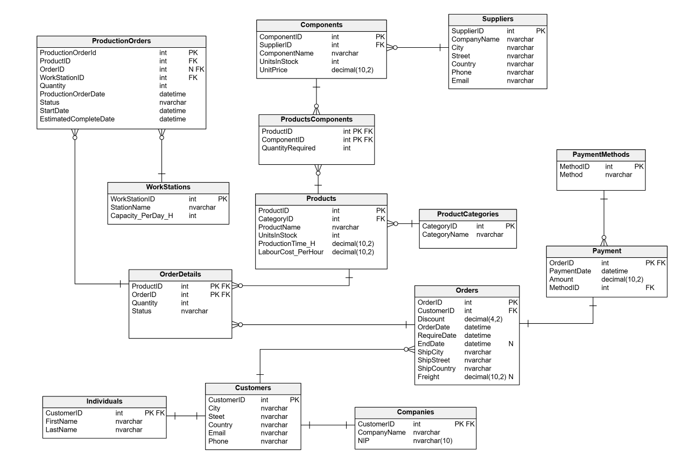

# **PODSTAWY BAZ DANYCH**

**poniedziałek 13:15**
 
**nr. zespołu: 16**
 
**Autorzy:** Natalia Trąba, Aleksandra Talaga, Karolina Węgrzyn
 

---

## **1. Założenia systemu**

### **Component**

- Dany komponent jest dostarczany przez tylko jednego suppliera
- UnitPrice to cena zakupu komponentu od suppliera
- UnitsInStock to liczba sztuk komponentu w magazynie

### **ProductsComponents**

- Przechowuje informacje, ile i jakich komponentów jest potrzebnych do produkcji produktu

### **ProductsCategories**

- Jedna kategoria może mieć wiele produktów

### **Products**

- UnitsInStock to liczba sztuk produktu w magazynie
- ProductionTime_H – z góry znany czas potrzebny do produkcji 1szt. danego produkty (wyrażony w godzinach)
- LabourCost_PerHour – z góry znany koszt 1 roboczogodziny potrzebnej do wyprodukowania 1szt. danego produktu

### **Orders**

- OrderDate – data złożenia zamówienia
- RequireDate – data do której klient wymaga wysłania zamówienia (będziemy do niej odnosić możliwości produkcyjne firmy)
- EndDate – data skompletowania zamówienia (kiedy Status w OrderDetails zmieni się na Ready)
- Status (Pending, Accepted/Rejected, Ready)
- ProductionCost (wartość całej produkcji) = cena komponentów(na 1 szt.) \* ilość komponentów (na 1 szt.) \* liczba produktów + ProductionTimeH \* LabourCostPerHour \* liczba produktów [sumujemy to dla każdego produktu]
- Liczba produktów to liczba wszystkich produktów z zamówienia nawet jeśli teraz ich nie produkujemy
- TotalPrice (Wartość całego zamówienia) = ProductionCost \* marża [suma dla każdego produktu] + Freight

 
 

### **OrderDetails**

- Quantity – ilość sztuk danego produktu, którą zamawia klient.
  Musimy porównać ją z UnitsInStock. Jeśli nie ma wystarczającej liczby produktów, to sprawdzamy czy jesteśmy w stanie wytworzyć wszystkie ilości produktów z danego zamówienia do zadanej przez klienta daty (bo znamy czas produkcji 1szt. jako ProductionTime_H w tabeli Products oraz czas kiedy maszyny będą wolne jako EstimatedCompleteDate w ProductionOrders). Jeśli jesteśmy w stanie wytworzyć dany produkt, Status zmienia się na WaitingForAccept i jest on zakolejkowany z odpowiednią datą StartDate (kiedy maszyna będzie wolna) i EstimatedCompleteDate w tabeli ProductionOrders. Jeśli wszystkie jesteśmy w stanie wytworzyć, to wtedy Status wszystkich zmienia się na Scheduled, a jeśli któregokolwiek nie jesteśmy w stanie zaakceptować, to status wszystkich zmienia się na Rejected (usuwane są wpisy zakolejkowane wcześniej z ProductionOrders) i odrzucamy też całe zamówienie. Status InProgress jest, kiedy produkt jest wytwarzany na maszynie (rozpoczynamy kiedy dzisiejsza data jest równa StartDate). StartDate może i w praktyce często będzie datą z przyszłości.
- Status (Pending, WaitingForAccept, Scheduled/Rejected, InProduction, Ready). Jeśli status wszystkich pozycji dla danego zamówienia zmieni się na Ready, wtedy status całego zamówienia zmienia się na Ready i ta data to jest EndDate w Orders

### **ProductionOrders**

- Quantity – wyliczona liczba produktów, której brakuje do spełnienia zamówienia / którą chcemy wytworzyć
- OrderID – null kiedy chcemy wytworzyć na zapas do magazynu lub po prostu id zamówienia
- ProductionOrderDate – moment zakolejkowania produktu
- StartDate – kiedy produkt zacznie być produkowany (kiedy maszyna się zwolni)
- EstimatedCompleteDate (StartDate + czas potrzebny do produkcji znany z tabeli Products)
- Status (Queued, InProduction, Ready)
- WorkStationID – id maszyny wytwarzającej

### **WorkStations**

- Capacity_PerDay_H – ile godzin dziennie może pracować (będzie uwzględniane przy wyliczaniu EstimatedCompleteDate)

### **Customers**

- Mogą być indywidualni lub firmowi

### **Payment**

- Każde zamówienie może być opłacone tylko raz. Amount to TotalPrice całego zamówienia

 
 
 
 
 
 

## **2. Schemat bazy danych**

